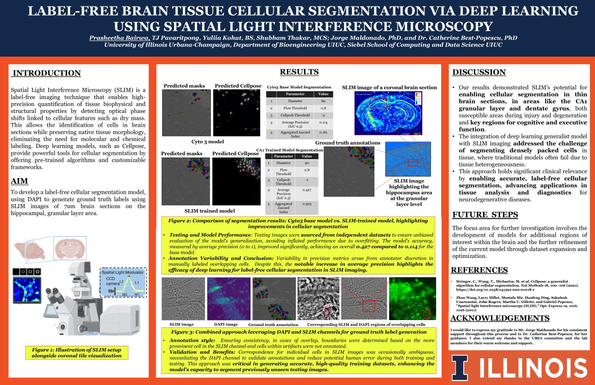

# SLIM Brain Tissue Segmentation

Deep learning image segmentation on label-free brain tissue microscopy using Spatial Light Interference Microscopy (SLIM).

## Research
Trained and fine-tuned PyTorch segmentation models on hippocampal brain sections, improving Jaccard index from 0.161 → 0.505.

Advised by Jorge Maldonado and [Dr. Catherine Best-Popescu](https://bioengineering.illinois.edu/people/cabest), [Cellular Neuroscience Imaging Laboratory](https://cellularlab.web.illinois.edu) at the Beckman Institute, UIUC.

Manuscript submitted for publication.

## Poster

